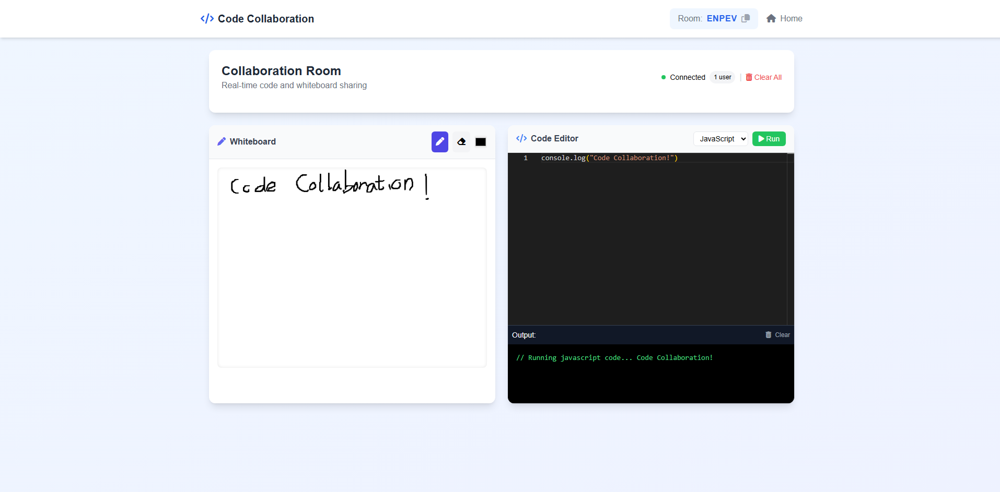

# Code Collaboration Web App

A real-time collaborative coding platform built with ASP.NET Core and SignalR, designed for pair programming sessions, technical interviews, and collaborative learning.



## Live Demo

The site was taken down temporarily due to the costs to keep it up. Sorry for the inconvenience.

## Features

- **Real-time Code Editor**: Collaborate on code with syntax highlighting for multiple languages
- **Integrated Whiteboard**: Share ideas visually with collaborative drawing tools
- **Room-based Collaboration**: Create or join rooms with unique 5-character codes
- **User Presence**: See who's currently in your room and get notified when users join or leave
- **Code Output Console**: View code execution output together in real-time
- **Multiple Language Support**: Switch between programming languages on the fly
- **Responsive Design**: Works on desktop and tablet devices

## Technology Stack

- **Backend**: ASP.NET Core with C#
- **Frontend**: HTML, CSS, JavaScript
- **Real-time Communication**: SignalR
- **Data Storage**: Azure Redis Cache
- **Hosting**: Azure App Service

## Architecture

The application uses a hub-and-spoke architecture with SignalR at the center:

- **SignalR Hub**: Manages real-time connections between users in the same room
- **Room Service**: Handles room creation, user tracking, and session management
- **Redis Cache**: Provides distributed storage for room data and user sessions
- **API Controllers**: Process HTTP requests for room creation and verification

## Getting Started for Developers

### Prerequisites

- .NET SDK 8.0 or later
- Visual Studio 2022 or Visual Studio Code
- Redis server (optional)

### Local Development Setup

1. Clone the repository:
   ```
   git clone https://github.com/yourusername/codecollaboration.git
   cd codecollaboration
   ```

2. Configure Redis connection:
   - Create a `secrets.json` file with your Redis connection information:
   ```json
   {
     "ConnectionStrings": {
       "RedisConnection": "your-redis-connection-string"
     }
   }
   ```
  - *Note: If you do not have a Redis server, you can use the RoomService class that uses an in-memory dictionary for storage.*
    - Replace the following code in `Program.cs`:
      ```csharp
      services.AddSingleton<IRoomService, RoomService>();
      ```

3. Build and run the application:
   ```
   dotnet build
   dotnet run
   ```

4. Open your browser and navigate to `https://localhost:7157`

### Deployment

The application is designed to be deployed to Azure App Service:

1. Create an Azure App Service
2. Set up an Azure Redis Cache instance
3. Configure connection strings in the Azure Portal
4. Deploy the application using Visual Studio or Azure DevOps

## Contributing

Contributions are welcome! Please feel free to submit a Pull Request.

## License

Do whatever you want.

## Acknowledgements

- [SignalR](https://dotnet.microsoft.com/apps/aspnet/signalr) for real-time communication
- [Monaco Editor](https://microsoft.github.io/monaco-editor/) for the code editor component
- [Azure](https://azure.microsoft.com/) for hosting and Redis cache services